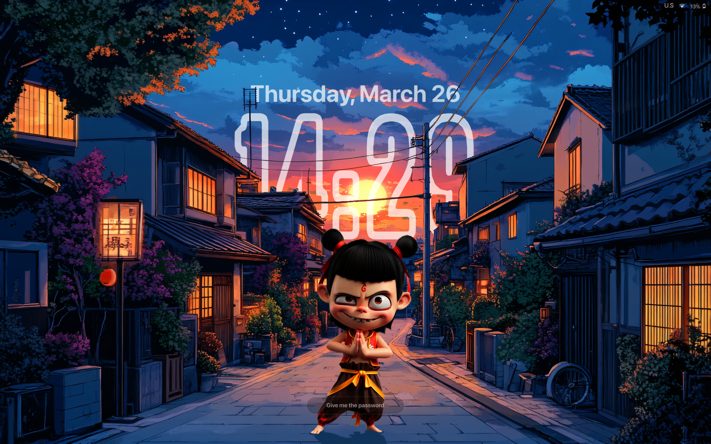

# neZha — SDDM Theme

A layered, minimal lockscreen aesthetic for SDDM with real-time clock, WiFi signal, battery, and keyboard layout indicators, designed to pair with the [neZha-Hyprlock-Theme](https://github.com/tuklu/neZha-Hyprlock-Theme).

---

## Preview



---

## Installation

### 1. Clone the repo

```bash
git clone https://github.com/tuklu/neZha-SDDM-Theme neZha
cd neZha
```

### 2. Download the assets

The background and overlay images are too large for git — download them from the [latest GitHub Release](https://github.com/tuklu/neZha-SDDM-Theme/releases/latest):

```bash
wget https://github.com/tuklu/neZha-SDDM-Theme/releases/latest/download/assets.tar.xz
tar -xJf assets.tar.xz -C assets/
rm assets.tar.xz
```

After this, `assets/` should contain:

```
assets/
  background.jpg
  foreground.png
  middleOverlay.png
```

### 3. Get the fonts

#### SF Pro Display Bold *(not bundled — Apple proprietary)*

This theme is designed for **SF Pro Display Bold**. To use it:

1. Download from the [Apple Developer page](https://developer.apple.com/fonts/)
2. Place `SF-Pro-Display-Bold.otf` into the `fonts/` directory

If SF Pro is absent, the theme falls back to the system `sans-serif` font.

### 4. Sync with the theme dir

```bash
sudo mkdir -p /usr/share/sddm/themes/neZha/
sudo rsync -a --delete \
  --exclude='.git' \
  --exclude='*.tar.gz' \
  --exclude='*.tar.xz' \
  ./ /usr/share/sddm/themes/neZha/
```

### 5. Enable the theme

```bash
# /etc/sddm.conf  or  /etc/sddm.conf.d/theme.conf
[Theme]
Current=neZha
```

---

## Configuration

Edit `theme.conf` to swap assets or change the text color:

```ini
[General]
background=assets/background.jpg
middleOverlay=assets/middleOverlay.png
foreground=assets/foreground.png
text_color=#b3ffffff
```

### Resolution and scaling

The theme is laid out against a `1600×1000` design canvas. `Main.qml` reads `Screen.width` and `Screen.height` at runtime and derives a single `scaleFactor`:

```
scaleFactor = clamp(min(screenWidth / 1600, screenHeight / 1000), 0.1, ∞)
```

That value is passed as a property into each component — `Clock.qml`, `LoginForm.qml`, and `StatusBar.qml` all multiply their internal pixel measurements by it. No component queries `Screen` directly; scaling is owned entirely by `Main.qml`.

If `Screen` reports `0` (can happen early in the SDDM session), the root falls back to the design dimensions so nothing breaks.

If the theme appears too large after an SDDM, Qt, or Arch update, check what the greeter reports:

```bash
sddm-greeter --test-mode --theme /path/to/neZha
# look for: Adding view for "..." QRect(0,0 WxH)
```

On HiDPI displays, SDDM may report logical pixels rather than physical pixels. The scale calculation adapts automatically — you should not need to touch any QML file per monitor.

If the installed greeter still looks zoomed while test mode looks correct, check for SDDM-level scaling overrides in `/etc/sddm.conf`, `/etc/sddm.conf.d/*.conf`, or `/usr/share/sddm/scripts/Xsetup`, such as `QT_SCALE_FACTOR`, `QT_SCREEN_SCALE_FACTORS`, or `QT_AUTO_SCREEN_SCALE_FACTOR`.

---

## Releases

Each release ships three downloadable artifacts in addition to the auto-generated source archives:

| File | Contents |
|---|---|
| `assets.tar.xz` | Background and overlay images (gitignored due to size) |
| `NeZha-SDDMtheme.tar.gz` | Ready-to-install theme bundle — no git or dev files |
| `v{version}.tar.gz` | Full source including README  |

The **pre-packaged theme bundle** (`NeZha-SDDMtheme.tar.gz`) is the fastest way to install without cloning:

```bash
wget https://github.com/tuklu/neZha-SDDM-Theme/releases/latest/download/NeZha-SDDMtheme.tar.gz
tar -xzf NeZha-SDDMtheme.tar.gz
sudo mv NeZha-SDDMtheme /usr/share/sddm/themes/neZha
rm NeZha-SDDMtheme.tar.gz
```

Then enable the theme as in step 5 above.

Checksums for each artifact are listed on the [Releases page](https://github.com/tuklu/neZha-SDDM-Theme/releases).

---

## Troubleshooting

### Status bar shows no data (WiFi / battery blank)

Qt 6 blocks local file reads from QML by default. Set the environment variable:

```bash
sudo mkdir -p /etc/sddm.conf.d
echo -e "[Environment]\nQML_XHR_ALLOW_FILE_READ=1" | sudo tee /etc/sddm.conf.d/env.conf
```

Reboot — the status bar should populate on next login.

### Theme looks zoomed in / oversized

1. Run test mode and note the reported resolution:
   ```bash
   sddm-greeter --test-mode --theme /usr/share/sddm/themes/neZha
   ```
2. Check for conflicting scale overrides:
   ```bash
   grep -r 'QT_SCALE\|QT_SCREEN_SCALE\|QT_AUTO_SCREEN' /etc/sddm.conf /etc/sddm.conf.d/ 2>/dev/null
   ```
3. Remove or unset the conflicting variable — the theme scales itself at runtime.

### Login loop (password accepted, back to greeter)

This is not a theme issue — it is usually a display server or PAM problem. Check:

```bash
journalctl -b -u sddm | tail -50
```

Common causes: wrong permissions on `~/.Xauthority`, a broken `.xinitrc`, or a failed Wayland compositor launch.

### Font falls back to sans-serif

SF Pro Display Bold is Apple-proprietary and cannot be bundled. Place `SF-Pro-Display-Bold.otf` in `/usr/share/sddm/themes/neZha/fonts/` (or the cloned repo's `fonts/` before syncing). The theme logs a warning to the SDDM journal if the font is missing but degrades gracefully.

### Black screen after enabling the theme

Verify the asset paths are populated:

```bash
ls /usr/share/sddm/themes/neZha/assets/
# must include: background.jpg  foreground.png  middleOverlay.png
```

If any are missing, re-run step 2 of the installation.

---

## Publishing a new release (maintainer notes)

When you update the assets, re-pack and attach them to the GitHub Release:

```bash
cd /path/to/neZha
tar -cJf assets.tar.xz assets/background.jpg assets/foreground.png assets/middleOverlay.png
sha256sum assets.tar.xz
# attach assets.tar.xz to the GitHub release and update the checksum in the release notes
```

---

## License

MIT — see [LICENSE](LICENSE)

> The bundled images are part of the theme's visual design. If you redistribute this theme, replace them with your own assets or ensure you have the rights to share them.
